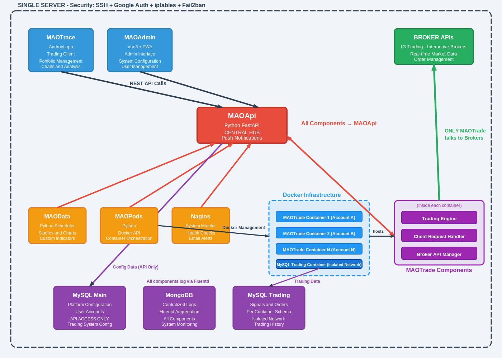

# MAOTrade - Showcase Architetturale

Estratti e documentazione del mio motore di trading algoritmico, sviluppato in Python per gestire strategie automatizzate sui mercati finanziari con capitale reale.

> **Nota**: Questo repository è una **vetrina tecnica** che mostra architetture, pattern e soluzioni implementate nel sistema reale MAOTrade. Non contiene un sistema eseguibile né algoritmi proprietari di trading.

## Perché questo repository

Mi chiamo Alessandro Osti ed ho sviluppato MAOTrade per automatizzare il mio trading sui mercati. Il sistema è in produzione e gestisce denaro reale, quindi ha richiesto soluzioni specifiche per problemi che non trovi nei tutorial:

- **Robustezza**: Crash durante mercato aperto = problemi seri
- **Multi-broker**: Volevo poter cambiare broker senza riscrivere tutto
- **Monitoring**: Devo sapere se qualcosa va storto, anche quando non ci sono
- **Recovery**: Se si verifica un crash alle 15:30, il sistema deve ripartire esattamente dove era

Questo repository documenta **come ho risolto questi problemi**.

## Stack Tecnologico e Scelte

- **Python 3.11**: Ecosystem finanziario ricco, sviluppo veloce
- **MySQL**: Query performance per analisi storiche, schema noto
- **Docker**: Un container per account, isolamento totale
- **Nagios**: Monitoring che conosco, alert che funzionano
- **Queue asincrone**: Comunicazioni non bloccanti tra componenti

## Architettura Generale



## Problemi Reali e Come Li Ho Risolti

### 1. Multi-Broker senza Riscrivere Tutto
**Il problema**: IG Trading ha le sue API, altri broker le loro. Non volevo rifare il motore per ogni broker.

**Come l'ho risolto**: Pattern Account Manager. Ogni broker implementa la stessa interfaccia, il core non sa con chi sta parlando.

```python
# Estratto: BaseAccountManager - Lo stesso per tutti i broker
class BaseAccountManager(ABC):
    """
    Ogni broker eredita da qui e implementa i suoi metodi.
    MAOTrade parla sempre la stessa lingua.
    """
    
    @abstractmethod
    def do_async_request_order_open(self, order: BaseOrder):
        """Apri posizione - ognuno lo fa a modo suo"""
        pass
    
    @abstractmethod  
    def account_manager_main(self, time_now: int):
        """Loop principale - gestisci le tue connessioni"""
        pass
        
    @abstractmethod
    def do_async_request_portfolio(self):
        """Richiedi posizioni aperte dal broker"""
        pass
```

[**Vedi implementazione completa →**](architecture/account_manager_abstraction.py)

### 2. Recovery dopo Crash
**Il problema**: Il server va in crash alle 15:30 mentre ho posizioni aperte. Deve ripartire sapendo esattamente cosa stesse facendo.

**Come l'ho risolto**: Auto-salvataggio dello stato in `BaseSystem`. Ogni system può sempre ricostruire la sua situazione, cosa ha già fatto, cosa dovrà ancora fare.

```python
# Estratto: Come gestisco la persistenza nel BaseSystem reale
class BaseSystem(ABC):
    def __init__(self):
        self._state = {}  # Tutto quello che metto qui viene salvato
        self._state_updated = False
        
    def process_data(self, frame_data, portfolio):
        # Il framework chiama do_process_data del mio sistema
        action, action_qty, action_stop = self.do_process_data(frame_data, portfolio)
        
        # Se modifico lo stato, viene salvato automaticamente
        if action != SystemAction.NOACTION:
            self.system_action = action
            self._state['actionTime'] = frame_data['timeNow']
            self._state_updated = True  # Trigger salvataggio
        
    @abstractmethod
    def do_resume_system(self, frame_data: list[dict], portfolio: dict, 
                        chart: ChartData, state: dict, log: list, 
                        time_now: int, import_uid: str) -> bool:
        """Al restart chiama questo con lo stato salvato"""
        pass
```

[**Vedi strategia completa →**](architecture/state_persistence_strategy.py)

### 3. Framework per Trading Systems
**Il problema**: Volevo poter scrivere nuove strategie velocemente senza ripetere la gestione ordini, stato, errori.

**Come l'ho risolto**: Framework `BaseSystem` che gestisce tutto l'overhead, io scrivo solo la logica.

```python
# Estratto: Il framework BaseSystem reale
class BaseSystem(ABC):
    """
    Gestisce automaticamente:
    - Salvataggio stato per recovery
    - Gestione ordini e tracking
    - Logging strutturato
    - Validazione parametri
    """
    
    @abstractmethod
    def do_process_data(self, frame_data: dict, portfolio: dict) -> tuple:
        """
        Qui metto la mia logica di trading.
        
        frame_data contiene:
        - frame: Unix timestamp del timeframe
        - open, high, low, close: Prezzi OHLC
        - vol: Volume
        - timeFrameEnd: True se candela chiusa
        - orderSubmitting: True se ordine in corso
        
        Devo ritornare: (SystemAction, quantità, stop_price)
        """
        return SystemAction.NOACTION, 0, 0
```

[**Vedi implementazione framework →**](architecture/base_system_framework.py)

### 4. Monitoring in Produzione

La mia configurazione Nagios distingue i servizi per criticità:

**Trading Critical Services** (alert immediato):
- MAOTrade Engine, MAOData, MAOPod
- Docker Daemon, Fluentd
- Check ogni 5-8 minuti, rinotifica ogni 15-30 min

**Infrastructure Services** (alert orario):
- MySQL performance, network, risorse sistema  
- Check ogni 3-10 minuti, rinotifica ogni 60 min

**Support Services** (alert ogni 4+ ore):
- Mail server, certificati SSL, aggiornamenti
- Check ogni 10+ minuti, rinotifica ogni 4-24 ore

### 5. Database e Persistenza
**Il problema**: Dati di trading, configurazioni e stato sistema devono essere organizzati per performance e sicurezza. I log devono essere conservati in modo persistente per garantire tracciabilità, analisi e troubleshooting affidabili.

**Come l'ho risolto**: Architettura multi-database con separazione delle responsabilità:

- **`maohome`**: Configurazione sistema, utenti, account, simboli
- **`maodata`**: Dati storici ticker, news, gestione analisi (studi)  
- **`mt_{account}`**: Database dinamici per ogni account trading
- **`maologs`**: Database su MongoDB per la gestione centralizzata dei log

[**Vedi schema completo →**](infrastructure/database_schema.md)

### 6. Container e Deploy
**Il problema**: Deploy isolato, configurazione flessibile senza rebuild, gestione dati sicura.

**Come l'ho risolto**: Container Docker con configurazione environment-based:

```dockerfile
# Environment variables per configurazione runtime
ENV LOG_LEVEL=info \
    TRADING_ENABLE=true \
    DAILY_CLEAN_TIME=23:45 \
    FLUENTD_ENABLE=true \
    WS_BASEURL=https://service.maotrade.it/maoapi
```

[**Vedi setup completo →**](infrastructure/docker_architecture.md)

### 7. API REST e Comunicazione Client-Server
**Il problema**: Gestire più applicazioni client (MAOTrace, MAOAdmin) mantenendo il motore di trading isolato e sicuro.

**Come l'ho risolto**: Gateway REST centralizzato con pattern MTProxy per comunicazione sicura verso MAOTrade.

```python
# Pattern MTProxy - Comunicazione sicura verso motore trading
class MTProxy:
    async def _send_request(self, host: str, port: int, message: str):
        """
        Protocollo socket custom per:
        1. Comandi trading real-time (JSON)
        2. Download log compressi (JSON + Binary stream)
        """
        # Invio JSON con delimitatore
        self._writer.write(message.encode() + struct.pack('<B', 4))
        
        # Gestione response mista JSON/Binary
        if response.get('binary_transfer'):
            await self._handle_binary_transfer()
```

[**Vedi architettura REST completa →**](docs/rest-api-architecture.md)

## Struttura Repository

```
├── docs/                     # Documentazione architettura completa
├── architecture/             # Estratti codice framework  
├── infrastructure/           # Setup Docker, monitoring, database
└── technical_decisions/      # Decisioni tecniche documentate
```

## Esempi di Utilizzo

Per esempi dettagliati di implementazione:
- **[Trading Systems](docs/trading-systems-framework.md)** - Architettura e sviluppo dei Trading Systems
- **[Broker Integration](docs/account-manager-pattern.md)** - Come gli Account Manager risolvono il problema del multi broker
- **[Monitoring Setup](docs/operational-monitoring.md)** - La strategia dietro al sistema di monitoring

## Decisioni Tecniche Chiave

- **[Perché Python per Trading](technical_decisions/why_python_for_trading.md)** - Stack moderno vs performance
- **[Gestione Errori](technical_decisions/error_handling_strategies.md)** - Retry, circuit breaker, recovery
- **[Ottimizzazioni Performance](technical_decisions/performance_optimizations.md)** - Connection pooling, threading, cache

## Cosa NON Troverai Qui

- ❌ **I miei algoritmi**: Le strategie che uso veramente sono proprietarie
- ❌ **Credenziali vere**: Nessun accesso ai miei broker reali
- ❌ **Sistema completo**: Solo le parti architetturalmente interessanti
- ❌ **Dati di mercato**: Niente feed o storici reali

## Obiettivo

Mostrare come affronto i problemi tecnici reali nello sviluppo di sistemi finanziari. Il focus è sul **processo di pensiero** e le **soluzioni architetturali** per un sistema che deve funzionare con soldi veri.

---
## Contatti

- 🌍 **Portfolio** → [maotrade.it](https://maotrade.it/index.html?utm_source=github&utm_medium=repository&utm_campaign=maotrade-showcase)  
- 📄 **Curriculum** → [Apri il CV](https://maotrade.it/alessandro-osti/index.html?utm_source=github&utm_medium=repository&utm_campaign=maotrade-showcase)  
-  **LinkedIn** → [linkedin.com/in/alosti](https://www.linkedin.com/in/alosti)  
  