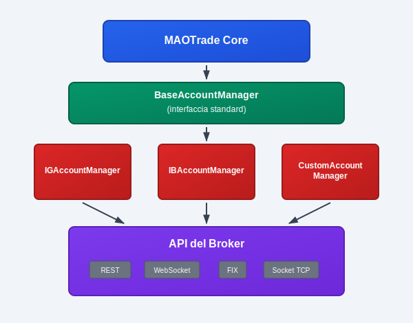

# MAOTrade - Account Manager

## Panoramica del Sistema

MAOTrade è un motore di trading algoritmico che deve interfacciarsi con broker diversi (IG Trading, Interactive Brokers, FIX-enabled brokers, ecc.). Ogni broker espone API differenti con protocolli e formati dati specifici. Il pattern **Account Manager** risolve questa complessità: si sviluppa un componente specifico per ogni broker che implementa un'interfaccia standard comune.

Il risultato è un sistema modulare dove MAOTrade opera in modo agnostico rispetto al broker sottostante, utilizzando sempre la stessa interfaccia standardizzata.

## Architettura Account Manager


Lo sviluppo è semplice: ogni Account Manager deve estendere BaseAccountManager e implementare i metodi astratti definiti. La comunicazione con il broker sottostante può utilizzare qualsiasi protocollo o tecnologia.

## La Classe Base: BaseAccountManager

Questa è la classe astratta che ogni Account Manager deve estendere. Fornisce:

- **Lifecycle management**: inizializzazione, startup, shutdown
- **State management**: gestione stati connessioni, errori, retry logic
- **Message queue**: comunicazione asincrona con il core MAOTrade
- **Error handling**: gestione disconnessioni e procedure di recovery

### Metodi che DEVONO essere implementati

```python
@abstractmethod
def on_account_manager_init(self):
    """Setup iniziale: configurazione connessioni, inizializzazione client"""

@abstractmethod
def account_manager_main(self, time_now: int):
    """Main loop chiamato ad ogni iterazione. Gestisce connessioni,
    processa messaggi, mantiene lo stato dell'Account Manager"""

@abstractmethod
def do_async_request_account_info(self):
    """Richiede informazioni account al broker (saldo, margine, equity)"""

@abstractmethod
def do_async_request_portfolio(self):
    """Richiede posizioni aperte dal broker"""

@abstractmethod
def do_async_request_market_data(self, request: dict) -> bool:
    """Gestisce sottoscrizioni/cancellazioni dati di mercato real-time"""
```

### Metodi per gestione ordini

```python
@abstractmethod
def do_async_request_order_open(self, order: BaseOrder):
    """Esegue apertura posizione"""

@abstractmethod
def do_async_request_order_close(self, order: BaseOrder):
    """Esegue chiusura posizione"""

@abstractmethod
def do_async_request_stop_order(self, order: BaseOrder):
    """Gestisce ordini stop loss/take profit"""
```

## Gestione della Configurazione

### Registrazione del Broker

Ogni nuovo broker deve essere registrato nel sistema attraverso l'interfaccia di amministrazione. Questo processo configura:

- **Identificativo broker** e denominazione
- **Classe Account Manager** da utilizzare (es. ig.IGAccountManager)
- **Parametri di configurazione** specifici del broker
- **Mapping strumenti finanziari** tra codici MAOTrade e codici broker

### Associazione Account-Broker

La relazione è strutturata come:

**Utente → Account → Broker → Account Manager**

All'avvio, MAOTrade:

1. Recupera la configurazione account tramite servizi REST
2. Identifica il broker associato e la classe Account Manager configurata
3. Carica dinamicamente la classe specificata
4. Istanzia l'Account Manager con le configurazioni broker-specifiche

### Esempio Configurazione Runtime

```python
# Configurazione ricevuta tramite REST API:
account_config = {
    'idAccount': 123,
    'brokerName': 'IG Trading',
    'brokerClass': 'ig.IGAccountManager',
    'brokerConfig': {
        'endpoint_demo': 'https://demo-api.ig.com',
        'endpoint_prod': 'https://api.ig.com',
        'timeout': 30,
        'max_retries': 5
    },
    'accountConfig': {
        'user': 'demo_user',
        'apiKey': 'encrypted_api_key'
    }
}
```

## Implementazione: Caso IG Trading

IG Trading utilizza API REST per operazioni e LightStreamer per dati real-time. Ecco l'implementazione:

### Setup e Inizializzazione

```python
class IGAccountManager(BaseAccountManager):
    def __init__(self, config: dict, in_queue: Queue, out_queue: Queue):
        super().__init__(config, in_queue, out_queue)
        self._client = IGClient(config)  # Client REST API
        self._lsclient = None  # Client LightStreamer

    def on_account_manager_init(self):
        # Configurazione time frame supportati dal broker
        history_frames = {1: "MINUTE", 5: "MINUTE_5", 60: "HOUR", -1: "DAY"}
        data_frames = {300: "5MINUTE", 60: "1MINUTE", 1: "SECOND"}
        return True, account_info, portfolio_info, order_template, history_frames, data_frames
```

### Main Loop

```python
def account_manager_main(self, time_now: int):
    # Gestione connessione API REST
    if not self._client.is_logged and time_now >= self._next_connect_attempt:
        self._connect_api()

    # Gestione connessione LightStreamer per dati real-time
    if self._client.is_logged and not self._feed_connected:
        self._connect_feed()

    # Processo messaggi HTTP asincroni
    self._client.process()

    # Processo messaggi LightStreamer
    if self._lsclient:
        self._lsclient.process()
```

### Gestione Ordini

```python
def do_async_request_order_open(self, order: BaseOrder):
    # Validazione ordine
    if not self._validate_order_parameters(order):
        order.set_rejected("Parametri ordine non validi")
        return

    # Chiamata API IG
    self._client.request_position_create({
        'epic': order.epicBroker,
        'direction': 'BUY' if order.qty > 0 else 'SELL',
        'size': abs(order.qty),
        'orderType': 'MARKET',
        'timeInForce': 'FILL_OR_KILL'
    }, callback=self._handle_order_response, custom_data={'order': order})

def _handle_order_response(self, response: dict, data: dict):
    order = data['order']
    if response.get('error'):
        order.set_rejected(response['error']['message'])
    else:
        deal_reference = response['json']['dealReference']
        order.set_submitted(deal_reference)
    
    # Notifica risultato a MAOTrade core
    self.send_request_order_response(order)
```

### Dati Real-time

```python
def do_async_request_market_data(self, request: dict) -> bool:
    if request['subscribe']:
        # Sottoscrizione nuovi dati
        return self._lsclient.subscribe_price_data(
            epic=request['epicBroker'],
            time_frame=request['timeFrame'],
            callback=self._process_market_data
        )
    else:
        # Cancellazione sottoscrizione
        return self._lsclient.unsubscribe_price_data(request['epic'])

def _process_market_data(self, data: dict):
    if data.get('data') and not data.get('error'):
        # Conversione formato IG → formato MAOTrade standard
        normalized_data = {
            'epic': data['data']['epic'],
            'date': data['data']['timestamp'],
            'open': data['data']['openPrice'],
            'high': data['data']['highPrice'],
            'low': data['data']['lowPrice'],
            'close': data['data']['closePrice'],
            'volume': data['data']['volume'],
            'completed': data['data']['lastTradedVolume'] > 0
        }
        
        # Invio dati al core MAOTrade
        self.send_realtime_data(normalized_data)
```

## Implementazioni Alternative

*Le seguenti implementazioni sono esempi dimostrativi che illustrano la flessibilità del sistema. Rappresentano possibili approcci per diversi tipi di broker e protocolli di comunicazione.*

### Interactive Brokers (TWS Connection)

**Esempio dimostrativo**: Interactive Brokers utilizza connessione socket TCP con protocollo proprietario:

```python
class IBAccountManager(BaseAccountManager):
    def __init__(self, config, in_queue, out_queue):
        super().__init__(config, in_queue, out_queue)
        self._socket = None
        self._message_handler = IBMessageHandler()

    def account_manager_main(self, time_now):
        # Gestione connessione socket TCP
        if not self._socket_connected:
            self._establish_socket_connection()
        
        # Lettura e parsing messaggi dalla socket
        self._process_incoming_socket_messages()

    def _establish_socket_connection(self):
        self._socket = socket.socket(socket.AF_INET, socket.SOCK_STREAM)
        self._socket.connect((self._config['tws_host'], self._config['tws_port']))
        self._perform_ib_handshake()
```

### Broker con Protocollo FIX

**Esempio dimostrativo**: Implementazione per broker che supportano protocollo FIX:

```python
class FIXAccountManager(BaseAccountManager):
    def __init__(self, config, in_queue, out_queue):
        super().__init__(config, in_queue, out_queue)
        self._fix_session = FIXSession(config)

    def do_async_request_order_open(self, order):
        # Costruzione messaggio FIX New Order Single
        fix_message = self._build_new_order_single_message(order)
        self._fix_session.send_message(fix_message)

    def _on_execution_report(self, fix_message):
        # Parsing FIX Execution Report
        order_id = fix_message.get_field(11)  # ClOrdID
        exec_type = fix_message.get_field(150)  # ExecType
        
        # Gestione stato esecuzione ordine
        self._process_order_execution(order_id, exec_type)
```

## Pattern di Comunicazione

### Architettura Asincrona

Tutti i metodi `do_async_*` sono **non bloccanti**. Il pattern implementato è request-callback:

```python
def do_async_request_account_info(self):
    # Richiesta non bloccante
    self._api_client.get_account_info(callback=self._handle_account_info)

def _handle_account_info(self, response):
    if response.success:
        account_data = self._normalize_account_data(response.data)
        self.send_account_info(0, account_data, int(time.time()))
    else:
        # Notifica errore al core
        self.send_account_info(1, {}, int(time.time()))
```

### Gestione Errori e Recovery

```python
def account_manager_main(self, time_now):
    # Implementazione pattern retry con exponential backoff
    if self._connection_failed and time_now >= self._next_retry_time:
        self._retry_attempts += 1
        backoff_seconds = min(300, 30 * (2 ** self._retry_attempts))
        self._next_retry_time = time_now + backoff_seconds
        
        if self._retry_attempts < self._max_retry_attempts:
            self._attempt_reconnection()
        else:
            self.send_account_disconnected(1, "Limite tentativi raggiunto")
```

## Integrazione con l'Ecosystem

### Conversione Strumenti Finanziari

Ogni broker utilizza propri identificativi per gli strumenti finanziari. La mappatura viene configurata centralmente:

```python
def _convert_epic_to_broker_format(self, maotrade_epic: str) -> str:
    # Esempi di conversioni configurate:
    # MAOTrade: "EURUSD" → IG: "CS.D.EURUSD.CFD.IP"
    # MAOTrade: "SPY" → IB: "SPY-USD-STK-SMART"
    # MAOTrade: "ES_FUT" → FIX: "ES-202412-FUT-CME"
    
    return self._epic_mapping.get(maotrade_epic, maotrade_epic)
```

### Configurazione Dinamica

L'Account Manager riceve configurazione via servizi REST all'avvio:

```python
# Esempio configurazione per nuovo broker
{
    'brokerName': 'CustomBroker',
    'brokerClass': 'custombroker.CustomAccountManager',
    'brokerConfig': {
        'base_url': 'https://api.custombroker.com',
        'websocket_url': 'wss://stream.custombroker.com',
        'timeout': 30,
        'rate_limit': 100
    },
    'epicMapping': {
        'EURUSD': 'EUR_USD_FX',
        'BTCUSD': 'BTC-USD-CRYPTO'
    }
}
```

## Checklist Implementazione

### Connessione e Autenticazione:
- [ ] Implementazione login/logout al broker
- [ ] Gestione token di autenticazione e refresh
- [ ] Retry logic per disconnessioni impreviste
- [ ] Timeout handling e connection pooling

### Gestione Ordini:
- [ ] Implementazione apertura posizioni (market/limit/stop)
- [ ] Gestione chiusura posizioni
- [ ] Supporto modifica/cancellazione ordini
- [ ] Implementazione stop loss e take profit
- [ ] Mapping accurato stati ordine broker → MAOTrade

### Dati di Mercato:
- [ ] Sottoscrizione/cancellazione dati real-time
- [ ] Gestione multiple sottoscrizioni simultanee
- [ ] Recovery da disconnessioni feed dati
- [ ] Conversione e normalizzazione time frame

### Error Handling e Monitoring:
- [ ] Gestione completa errori API broker
- [ ] Implementazione recovery automatico
- [ ] Logging strutturato per debugging
- [ ] Notifiche appropriate al core MAOTrade

### Testing e Validazione:
- [ ] Test con account demo del broker
- [ ] Validazione mappatura strumenti finanziari
- [ ] Test scenari di disconnessione/reconnessione
- [ ] Verifica performance sotto carico

## Conclusioni

Lo sviluppo di un Account Manager per MAOTrade richiede competenze specifiche in:

1. **Comunicazione asincrona** - gestione efficace di callback e code non bloccanti
2. **Error handling robusto** - recovery automatico da disconnessioni e gestione stati inconsistenti
3. **State management avanzato** - sincronizzazione precisa di stati connessioni, ordini e posizioni
4. **Data transformation** - normalizzazione accurata tra formati broker e standard MAOTrade
5. **Integration patterns** - corretta integrazione con l'ecosystem di configurazione esistente

Il sistema basato su Account Manager fornisce l'infrastruttura e i pattern necessari, mentre il developer implementa la logica specifica per il broker target.

Il risultato è un sistema altamente modulare dove MAOTrade può operare su qualsiasi broker senza modifiche al motore core. Ogni broker diventa un componente intercambiabile, configurato e gestito centralmente attraverso l'interfaccia di amministrazione.