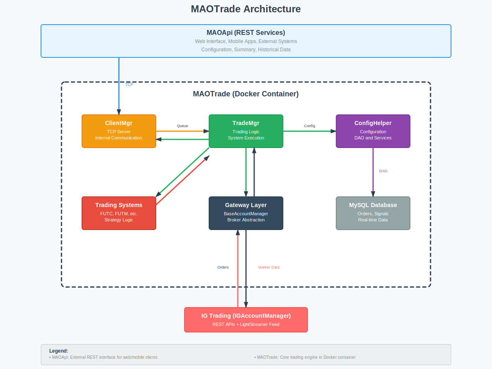

# **MAOTrade - Motore di Trading Algoritmico**

## **Cosa è MAOTrade**

MAOTrade è un motore di trading algoritmico sviluppato in Python che gestisce strategie di trading automatizzate su mercati finanziari. Il sistema è progettato per essere robusto, modulare e capace di operare 24/7 gestendo soldi reali.

**Stack tecnologico:**

- Python 3.11
- MySQL per persistenza
- Gateway Layer per comunicazioni broker (protocollo-agnostic)
- Docker per deployment
- Feed real-time tramite implementazione specifica broker

## **Architettura Generale**


### **Componenti Principali**

1. **ClientMgr** - Gestisce le comunicazioni con applicazioni client
2. **TradeMgr** - Core del motore, gestisce strategie e ordini
3. **Gateway Layer** - Astrazione per broker diversi
4. **Trading Systems** - Strategie pluggabili
5. **Configuration & Services** - Supporto infrastrutturale

## **ClientMgr - Gestione Comunicazioni**

Il ClientMgr gestisce le comunicazioni interne tramite server TCP. È utilizzato da MAOApi per specifiche richieste che richiedono accesso diretto al motore di trading.

**Caratteristiche:**

- **Thread per connessione**: Ogni connessione ha un thread dedicato
- **Limite connessioni**: Configurabile (default 10)
- **Protocollo JSON**: Messaggi strutturati su TCP
- **Queue asincrone**: Comunicazione non-bloccante con TradeMgr

**Servizi interni:**

- Interrogazione stato systems
- Operazioni su ordini specifiche
- Retrieve dati real-time
- System testing e validation

```json
// Esempio richiesta client
{
  "service": 1,    // Apertura posizione
  "srvOpId": 123,
  "qty": 100.0
}
```

## **TradeMgr - Core del Motore**

Il TradeMgr è il cuore del sistema. Gestisce il ciclo di vita delle strategie di trading, dalla ricezione dati di mercato all'esecuzione ordini.

### **Strutture Dati Principali**

- **Trading Sessions**: Sessioni di trading attive con i loro segnali
- **Title Table (TT)**: Mappa epic → system instance con stato runtime
- **Portfolio State**: Posizioni correnti dal broker
- **Market Data**: Flusso real-time aggregato per timeframe

### **Main Loop**

Il TradeMgr opera in un loop principale che:

1. **Verifica connessione broker** e stato account
2. **Carica sessioni di trading** attive per la giornata
3. **Processa dati real-time** dal broker
4. **Esegue logica systems** per ogni strumento
5. **Gestisce ordini** e lifecycle
6. **Aggiorna summary** per client

```python
def trade_mgr_main(self):
    # Controlli connessione e stato
    self.check_account_manager(time_now)
    self.check_gw_account(time_now)
    self.check_gw_portfolio(time_now)
    
    # Logica trading
    self.check_trading_sessions(time_now)
    self.check_title_table(time_now)
    
    # Process eventi broker
    self.process_gateway_data()
```

### **Gestione Dati Real-time**

I dati di mercato arrivano dal Gateway Layer e vengono processati attraverso pipeline di validazione:

1. **Validazione basic**: No valori zero, timeframe corretto
2. **Controllo trading hours**: Scarta dati fuori orario
3. **Aggregazione timeframe**: Da timeframe broker a timeframe system
4. **Dispatch ai systems**: Ogni system riceve i suoi dati

```python
# Frame aggregation per timeframe system
tt['lastData']['high'] = max(tt['data']['high'], market_data['high'])
tt['lastData']['low'] = min(tt['data']['low'], market_data['low'])
tt['lastData']['vol'] = tt['data']['vol'] + market_data['volume']
```

## **Gateway Layer - Astrazione Broker**

Il Gateway Layer astrae le specifiche dei broker attraverso un'interfaccia comune. Attualmente implementato per IG Trading.

### **BaseAccountManager**

Classe base che definisce l'interfaccia standard:

- Connessione/disconnessione
- Gestione ordini (apertura/chiusura/modifica)
- Subscribe dati real-time
- Gestione portfolio ed account info

### **IGAccountManager**

Implementazione specifica per IG Trading:

- **API Connection**: Login/logout con gestione token
- **LightStreamer Feed**: WebSocket per dati real-time
- **Order Management**: REST APIs per ordini
- **Error Handling**: Retry logic e reconnection automatica

```python
# Struttura stato connessioni
self._state = {
    'api': {
        'nextConnect': 0,
        'apiErrorCount': 0,
        'maxConnectRetry': 10
    },
    'feed': {
        'nextConnect': 0,
        'feedErrorCount': 0,
        'maxConnectRetry': 10
    }
}
```

### **Gestione Errori e Resilienza**

- **Exponential backoff** per reconnection
- **Circuit breaker** pattern per API failures
- **Health monitoring** continuo
- **Graceful degradation** quando possibile

## **Trading Systems - Strategie Pluggabili**

I trading systems sono la logica di business del motore. Ogni system implementa una strategia specifica.

### **BaseSystem**

Ogni trading system eredita da BaseSystem che fornisce:

- **Lifecycle management**: init, validate, process_data, resume
- **Order management**: Creazione e tracking ordini
- **State persistence**: Salvataggio stato per recovery
- **Logging integrato**: Per debug e audit

### **Esempio: FUTC System**

```python
class FUTC(BaseSystem):
    def do_process_data(self, frame_data, portfolio):
        # Analisi tecnica su frame_data
        if self._should_buy(frame_data):
            return SystemAction.BUY, qty, stop_price
        elif self._should_sell(frame_data):
            return SystemAction.SELL, qty, stop_price
        else:
            return SystemAction.NOACTION, 0, 0
```

### **Caratteristiche Systems**

- **Configurabili**: Parametri utente modificabili
- **Validazione**: Controlli pre-execution
- **Recovery**: Resume automatico dopo restart
- **Monitoring**: Health check e performance tracking

## **Gestione Ordini**

### **Lifecycle Ordine**

1. **System genera segnale** (BUY/SELL/NOACTION)
2. **TradeMgr crea ordine** con validazioni
3. **Invio al broker** via Gateway
4. **Tracking esecuzione** fino a completamento
5. **Update portfolio** e notifiche

### **Stati Ordine**

```python
class OrderExecState(IntEnum):
    NOT_SUBMITTED = 0
    DELAYED = 1
    SUBMITTING = 2
    SUBMITTED = 3
    EXECUTING = 4
    REJECTED = 5
```

### **Gestione Stop Loss**

Il sistema gestisce gli ordini di stop attraverso il Gateway Layer secondo le modalità supportate dal broker specifico.

## **Persistenza e Database**

### **Schema Database**

- **operazioni**: Segnali di trading e configurazioni
- **orders**: Storia ordini con timing preciso (mt_created/mt_modified)
- **rlt_**\*: Tabelle dinamiche per dati real-time per system
- **system**: Configurazioni systems disponibili

### **MTDAO - Data Access**

La classe MTDAO gestisce tutte le operazioni database con:

- **Connection pooling** automatico
- **Query logging** opzionale
- **Transazioni** per operazioni atomiche
- **Health monitoring** connessioni

## **Configuration Management**

### **AppConfig**

Gestisce configurazione attraverso file INI con:

- **Environment variable substitution**
- **Fallback values** per robustezza
- **Validation** dei parametri critici
- **Hot reload** per parametri non critici

### **Configurazioni Principali**

- **Database**: Host, credenziali, pool settings
- **ClientMgr**: Porta, limiti connessioni
- **Trading**: Abilitazione, orari pulizia
- **Logging**: Livelli, destinazioni, formato
- **Broker**: Credenziali, endpoints

## **Monitoring e Observability**

### **Logging Strutturato**

Il sistema usa logging hierarchico con:

- **Severity levels**: DEBUG, INFO, WARNING, ERROR, CRITICAL
- **Topics**: Categorizzazione messaggi (TRADING, SYSTEM, SERVICE)
- **Structured data**: Informazioni contestuali
- **Multiple outputs**: Console, file, Fluentd

### **Health Monitoring**

- **Connection health**: API e feed broker
- **System health**: Performance e errori systems
- **Data freshness**: Controllo staleness dati critici
- **Portfolio integrity**: Consistenza posizioni

### **Performance Tracking**

Le tabelle ordini includono timing preciso:

- `mt_created`: Timestamp creazione richiesta
- `mt_modified`: Timestamp ogni cambio stato
- **Latenza ordini**: Differenza per performance analysis

## **Deployment e Scalabilità**

### **Containerizzazione**

MAOTrade è containerizzato con Docker per:

- **Isolamento**: Ogni account in container separato
- **Scaling**: Multiple accounts su stesso host
- **Deployment**: Consistenza ambienti
- **Resource management**: Limiti CPU/memoria

### **Gestione Multi-Account**

Per gestire più account broker:

1. **Un container per account**
2. **Orchestrator esterno** gestisce containers
3. **Health monitoring** centralizzato
4. **Configuration injection** per account specifici

## **Considerazioni di Sicurezza**

### **Isolamento Network**

- **No esposizione diretta**: MAOTrade dietro proxy/load balancer
- **Comunicazione interna**: Solo con servizi autorizzati
- **Credenziali**: Encrypted in configurazione

### **Audit Trail**

- **Logging completo** operazioni critiche
- **Database persistence** di tutti gli ordini
- **Traceability** end-to-end per debugging

## **Performance e Robustezza**

### **Caratteristiche Performance**

- **Sub-second latency**: Dall'arrivo dato a invio ordine
- **Memory efficient**: Gestione attenta delle strutture dati
- **CPU optimized**: Algoritmi efficienti per analisi real-time

### **Robustezza Operativa**

- **Auto-recovery**: Restart automatico dopo errori fatali
- **Graceful shutdown**: Chiusura pulita delle connessioni
- **Data integrity**: Nessuna perdita stato critico
- **Error isolation**: Errore su un system non affetta gli altri

## **Estensibilità**

### **Nuovi Broker**

Implementare nuovo BaseAccountManager:

1. **Override metodi astratti** per API specifiche
2. **Gestire peculiarità** del broker
3. **Mapping** tra formati dati
4. **Testing** con account demo

### **Nuovi Systems**

Creare nuovo trading system:

1. **Ereditare da BaseSystem**
2. **Implementare logica** in `do_process_data`
3. **Definire parametri** configurabili
4. **Aggiungere validazioni** specifiche

## **Conclusioni**

MAOTrade è un motore di trading con architettura modulare che separa le responsabilità tra gestione comunicazioni, logica di trading e interfacciamento broker. Il sistema opera con capitale reale gestendo il ciclo completo dall'arrivo dei dati di mercato all'esecuzione degli ordini.

L'implementazione include gestione degli errori, retry logic e monitoring per operatività continua. L'architettura permette estensione per nuovi broker e nuove strategie di trading.