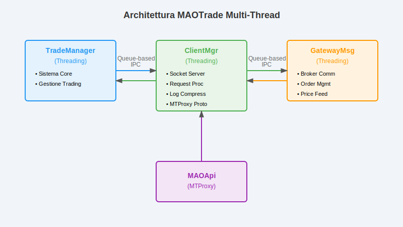

# MAOTrade REST API Architecture - Guida Tecnica

**MAOApi** è il cuore dell'architettura di servizio di MAOTrade: un gateway REST che orchestra la comunicazione tra client, servizi e il motore di trading. 

## Perché un'Architettura REST Dedicata

Nel progetto MAOTrade ho scelto di centralizzare tutta la comunicazione attraverso API REST dedicate per risolvere problemi specifici:

- **Isolamento del Core**: Il motore di trading non espone mai direttamente le sue API
- **Multi-Client**: MAOTrace (client), MAOAdmin (amministrazione) e servizi interni condividono lo stesso backend
- **Sicurezza Centralizzata**: Autenticazione Firebase, rate limiting e audit trail in un punto solo
- **Scalabilità**: Posso deployare più istanze API senza toccare il core trading

## Stack Tecnologico

```python
# Stack principale
FastAPI          # Framework web asincrono
SQLAlchemy 2.x   # Toolkit SQL, gestione connessioni con supporto async/await 
Pydantic v2      # Validazione e serializzazione modelli
Firebase Auth    # Gestione autenticazione utenti
Fluentd          # Aggregazione log distribuiti
MySQL 8.x        # Database principale con pool asincroni
MongoDB          # Logging centralizzato
Gunicorn         # Production WSGI server
```

## Architettura Generale


## Pattern Architetturali Implementati

### 1. Routing Modulare per Domini

Ho organizzato le API in **5 domini principali**, ognuno con responsabilità specifiche:

```python
# Estratto da main.py - Organizzazione dei router
app.include_router(services_router, prefix="/srv")       # Servizi piattaforma
app.include_router(client_router, prefix="/client")      # MAOTrace app
app.include_router(client_mt_router, prefix="/clientmt") # MAOTrace ↔ MAOTrade  
app.include_router(admin_router, prefix="/admin")        # MAOAdmin tools
app.include_router(mt_router, prefix="/mt")              # MAOTrade interno
```

**Perché questa separazione?**
- **`/srv`**: API condivise (ticker data, notifiche push, studi tecnici)
- **`/client`**: MAOTrace standalone (ricerca titoli, watchlist, analisi)  
- **`/clientmt`**: MAOTrace con features trading (portfolio, segnali, sistemi)
- **`/admin`**: Gestione account, configurazioni, monitoring
- **`/mt`**: Solo per il motore MAOTrade (configurazioni interne, epic lookup)

### 2. Pattern Controller Stratificato

Ogni endpoint segue la stessa struttura **Request → Controller → Business Logic**:

```python
# Esempio reale da services.py
@router.post("/ticker/market-data",
             summary="Get ticker market data", 
             tags=["Services"],
             response_model=ResponseModel[list[TickerDataModel]])
async def srv_get_ticker_data(
    data_in: GetTickerDataRequestModel, 
    request: Request,
    _=Depends(BaseController.check_service),  # Security layer
    db: AsyncSession = Depends(get_db)        # Database injection
):
    controller = GetTickerDataController(request)
    return await controller.process(data_in, db)
```

### 3. Sistema di Autenticazione a Livelli

Ho implementato **3 livelli di sicurezza** diversi in base al tipo di client:

#### Utenti Firebase (MAOTrace)
```python
# BaseController.py - Validazione token Firebase
@staticmethod
async def check_user(request: Request, 
                     authorization: HTTPAuthorizationCredentials = Depends(HTTPBearer())):
    """Valida il token Firebase e carica i dati utente"""
    
    try:
        # Verifica token Firebase
        decoded_token = auth.verify_id_token(authorization.credentials)
        
        # Carica dati utente dal database  
        statement = text("SELECT id,userid,displayname,email,valido,stato,admin "
                        "FROM mtrace_users WHERE userid=:user_id")
        user_data = await session.execute(statement, {'user_id': decoded_token['uid']})
        
        # Controlla stato account (attivo, scaduto, bloccato)
        if user_data['stato'] != 1:
            return ResponseModel(code=11, message="Account non attivo")
            
        return None  # OK
        
    except ExpiredIdTokenError:
        return ResponseModel(code=10, message="Token scaduto")
    except InvalidIdTokenError: 
        raise_http_error(status_code=404, msg="Token non valido")
```

#### Servizi Interni (Service-to-Service)
```python  
# BaseController.py - Autenticazione per servizi
@staticmethod
def check_service(request: Request, service_cert: str = Header()):
    """Token pre-condiviso con scadenza temporale per servizi interni"""
    
    def get_current_token(minutes_ago: int = 0) -> str:
        time_base = datetime.now(timezone.utc) - timedelta(minutes=minutes_ago) 
        string = f"TradingPlatform S3rv9ce C3rt9fic8t3 9ss23d @: {time_base.strftime('%Y-%m-%dT%H:%M')}"
        return base64.b64encode(hashlib.sha256(string.encode()).digest()).decode()
    
    # Accetta token corrente o del minuto precedente (per clock skew)
    if service_cert not in [get_current_token(), get_current_token(1)]:
        raise_http_error(status_code=404, msg="Service token non valido")
    
    return True
```

### 4. Pattern MTProxy - Comunicazione verso MAOTrade

Il problema più complesso che ho risolto è la **comunicazione sicura tra API e motore trading**. MAOTrade gira isolato con architettura multi-thread, ma MAOTrace deve poter inviare ordini e ricevere dati portfolio.



**Soluzione: Pattern Proxy con Socket TCP + Protocollo Binario**

```python
# MTProxy.py - Implementazione protocollo socket custom
class MTProxy:
    async def _send_request(self, host: str, port: int, message: str) -> ProxyResult:
        """
        Protocollo personalizzato per comunicazione con MAOTrade:
        
        1. Apertura socket TCP
        2. Invio JSON request con delimitatore
        3. Ricezione response JSON + optional binary data
        4. Gestione stream binari per file grandi (log, export)
        """
        # Definizione del delimitatore tra JSON e dati binari
        binary_data_delimiter = b'\x00\xFFmtbinary\x00\xFF'
        
        try:
            self._reader, self._writer = await asyncio.open_connection(host, port)
            
            # Invio richiesta JSON con marker di fine messaggio
            self._writer.write(message.encode() + struct.pack('<B', 4))
            await self._writer.drain()
            
            # Ricezione risposta con buffer dinamico
            buffer = bytearray()
            max_buffer_size = 1024 * 1024  # 1MB limite
            
            # Ricerca del delimitatore nel flusso
            while len(buffer) < max_buffer_size:
                chunk = await self._reader.read(4096)
                if not chunk:
                    break
                buffer.extend(chunk)
                
                # Cerca delimitatore JSON/binary
                delimiter_pos = buffer.find(binary_data_delimiter)
                if delimiter_pos != -1:
                    # JSON trovato, estrai response
                    json_data = buffer[:delimiter_pos]
                    self._response = json.loads(json_data.decode('utf-8'))
                    
                    # Se previsto trasferimento binario, gestiscilo
                    if self._response.get('data', {}).get('binary_transfer', False):
                        await self._handle_binary_transfer(buffer[delimiter_pos:])
                    break
                        
            return ProxyResult.NO_ERROR
            
        except asyncio.TimeoutError:
            return ProxyResult.ERROR_CODE_SOCKET_CONNECT
        except Exception as e:
            self._error_message = f"Errore comunicazione: {str(e)}"
            return ProxyResult.ERROR_CODE_SOCKET_READ
        finally:
            self._close_connection()
```

#### Due Modalità di Comunicazione MTProxy

**1. Comunicazione Comando/Risposta (JSON)**
Per controllo trading systems, gestione segnali, richiesta stato portfolio:

```python
# ClientMgr.py - Gestione richieste trading real-time
class ClientMgr(threading.Thread):
    """
    Thread dedicato alla comunicazione client in MAOTrade.
    Gestisce socket server, parsing richieste e coordinamento con TradeManager.
    """
    
    def _process_request(self, client_address, data: dict) -> str:
        """
        Router interno per servizi MAOTrade:
        - service 1: Log del server
        - service 2: Comandi verso TradeManager (trading operations)  
        - service 3: Dati system e datastore management
        - service 4: Test system backtesting
        - service 5: Attività account e configurazioni
        """
        match data['service']:
            case 2:  # Trading commands via TradeManager queue
                return self._req_cmd_trade_manager(data['data'], client_address[1])
            case 1:  # Log server (compression on-demand)
                return self._req_service_log(data['data'])
            # ... altri servizi
        
    def _req_cmd_trade_manager(self, data: dict, sock_id: int) -> str:
        """
        Inoltra comandi al TradeManager tramite Queue inter-thread.
        
        Servizi supportati:
        - srvId 8: Validazione segnali con sistema di trading
        - srvId 1/2: Add/Close posizioni 
        - srvId 5: Update configurazioni account
        """
        valid = True
        
        match data['srvId']:
            case 8:  # Validazione segnale
                if signal_prepared := SignalsHelper.prepare_user_signal(data['signal']):
                    try:
                        data['system'] = get_system(signal_prepared)
                        if not data['system']:
                            return self._create_data_frame(code=453, 
                                                         message="System non trovato")
                    except Exception:
                        return self._create_data_frame(code=453, 
                                                     message="Errore system")
        
        # Inoltra a TradeManager via Queue
        if valid:
            tm_request = {
                'sock': sock_id,
                'request': data,
                'response': {'code': 0, 'data': {}, 'error': False}
            }
            self._out_queue.put(tm_request)  # → TradeManager
            return "#"  # Risposta differita via queue
```

**2. Download Log Files (JSON + Binary Stream)**
Per accesso ai log dettagliati MAOTrade (350KB/giorno, retention anni):

```python
# ClientMgr.py - Gestione download log con compressione ZIP
def _get_binary_data(self, request: dict, response: dict) -> bytes:
    """
    Genera ZIP dei log giornalieri MAOTrade per download amministrativo.
    
    Scenario: Log interni al container Docker su named volume.
    Soluzione: Compressione al volo e trasferimento via socket.
    
    Dimensioni tipiche:
    - Log giornaliero: ~350KB 
    - ZIP compresso: ~50-100KB
    - Retention: Anni (spazio esiguo, valore diagnostico alto)
    """
    if request['service'] == 1:  # Service log
        log_date = request['data']['logDate']
        
        # Creazione ZIP in memoria
        zip_buffer = io.BytesIO()
        with zipfile.ZipFile(zip_buffer, 'w', zipfile.ZIP_DEFLATED) as zipf:
            log_files = self._get_log_files_for_date(log_date)
            
            for log_file in log_files:
                if os.path.exists(log_file):
                    # File automaticamente locked durante lettura
                    zipf.write(log_file, os.path.basename(log_file))
        
        zip_buffer.seek(0)
        return zip_buffer.getvalue()

def _handle_client(self, client_sock, client_address, client_queue):
    """
    Gestione client con protocollo unificato JSON + Binary.
    
    Pattern: JSON header → Binary data (se richiesto)
    """
    try:
        # Ricezione richiesta con marker fine messaggio
        data_enc = client_sock.recv(self._config['maxRequestSize'])
        ind = data_enc.index(4)  # Marker byte
        request_data = json.loads(data_enc[:ind].decode())
        
        resp = self._process_request(client_address, request_data)
        
        if resp:
            response_obj = json.loads(resp)
            # Check per trasferimento binario
            if response_obj.get('data', {}).get('binary_transfer', False):
                binary_data = self._get_binary_data(request_data, response_obj)
                
                if binary_data:
                    # Invio JSON header
                    client_sock.sendall(resp.encode('utf-8'))
                    # Delimitatore JSON/Binary
                    client_sock.sendall(b'\x00\xFFmtbinary\x00\xFF')
                    # Dimensione binary data (4 bytes big-endian) 
                    client_sock.sendall(len(binary_data).to_bytes(4, byteorder='big'))
                    # Stream dati binari
                    client_sock.sendall(binary_data)
                    
    except Exception as e:
        self._log.exception(f"Errore client {client_address}")
```

#### Streaming Binario per Log ZIP

```python
# MTProxy.py - Streaming ottimizzato per log compressi (max 1MB)
async def stream_binary_data(self, chunk_size: int = 65535) -> AsyncGenerator[bytes, None]:
    """
    Stream per file ZIP log MAOTrade.
    
    Ottimizzato per file ~1MB max, quindi senza ottimizzazioni eccessive.
    Timeout 15s per chunk è adeguato per questa dimensione.
    """
    if not self._binary_info or not self._reader:
        raise ValueError("Nessun trasferimento binario in corso")

    try:
        total_size = self._binary_info['size']  # Dimensione ZIP
        bytes_read = 0

        # Invia eventuali dati già in buffer dal parsing JSON
        if self._binary_buffer:
            yield bytes(self._binary_buffer)
            bytes_read += len(self._binary_buffer)
            self._binary_buffer = None

        # Stream socket con timeout appropriato per 1MB
        while bytes_read < total_size:
            remaining = total_size - bytes_read
            read_size = min(chunk_size, remaining)

            chunk = await asyncio.wait_for(
                self._reader.read(read_size),
                timeout=15.0  # OK per file max 1MB
            )

            if not chunk:
                break

            if isinstance(chunk, bytearray):
                chunk = bytes(chunk)  # Fix FastAPI compatibility

            bytes_read += len(chunk)
            yield chunk

        # Verifica completezza trasferimento
        if bytes_read != total_size:
            raise ValueError(f"Trasferimento ZIP incompleto: {bytes_read}/{total_size}")

    except asyncio.TimeoutError:
        raise ValueError(f"Timeout download log ZIP dopo {bytes_read} bytes")
    finally:
        self._close_connection()
```

### 5. Gestione Database con Connection Pooling Avanzato

La gestione database include auto-recovery e connection pooling ottimizzato:

```python
# DatabaseSessionManager.py - Pool asincrono robusto
class DatabaseSessionManager:
    def init_db(self, database_url: str, database_log: bool):
        self.engine = create_async_engine(
            database_url, 
            pool_size=30,           # 30 connessioni attive
            max_overflow=0,         # No overflow per controllo strict
            pool_pre_ping=True,     # Test connessioni prima dell'uso
            pool_recycle=3600,      # Ricicla connessioni ogni ora
            pool_timeout=10,        # Timeout acquisizione connessione
            echo=database_log
        )
        
        self.session_maker = async_sessionmaker(
            self.engine, 
            autoflush=False,
            autocommit=False, 
            expire_on_commit=False,
            class_=AsyncSession
        )

    async def get_session(self) -> AsyncSession:
        """Auto-recovery su disconnessione database"""
        try:
            # Test connessione corrente
            async with self.session_maker() as session:
                await session.execute(text("SELECT 1"))
        except (OperationalError, DisconnectionError):
            # Auto-riconnessione su fallimento
            await self.reconnect()

        return self.session_maker()
        
    async def reconnect(self):
        """Reinizializza pool connessioni"""
        await self.close()
        self.init_db(self.database_url, self.database_log)
```

#### Decorator Transazionale
```python
# config.py - Gestione transazioni automatica
def transactional() -> Callable:
    def decorator(func: Callable) -> Callable:
        @wraps(func)
        async def wrapper(*args, **kwargs):
            db = next((arg for arg in args if isinstance(arg, AsyncSession)), None)
            if db is None:
                db = kwargs.get('db')
            if not db:
                raise ValueError("Database session not provided")

            try:
                result = await func(*args, **kwargs)
                await db.commit()
                return result
            except Exception as e:
                await db.rollback()
                raise e
        return wrapper
    return decorator
```

### 6. Threading Control e Rate Limiting

Per evitare sovraccarico delle risorse:

```python
# config.py - Controllo concorrenza globale
MAX_CONCURRENT_THREADS = 15
MAX_THREADS_GUARD = Semaphore(MAX_CONCURRENT_THREADS)

async def run_async(func: Callable[P, T], *args: P.args, **kwargs: P.kwargs) -> T:
    """Limita threads concorrenti per operazioni CPU-intensive"""
    async with MAX_THREADS_GUARD:
        return await run_in_threadpool(func, *args, **kwargs)
```

### 7. Middleware di Logging e Request Tracking

Ogni richiesta viene tracciata end-to-end con **Request ID univoco**:

```python
# main.py - Middleware di logging con timing
@app.middleware("http") 
async def log_requests(request: Request, call_next):
    # Genera ID univoco per tracciabilità
    request_id = ''.join(random.choices(string.ascii_uppercase + string.digits, k=10))
    request.state.request_id = request_id
    
    # Log richiesta in entrata
    device_info = f" - devId: {request.headers.get('deviceid', '')}" if request.headers.get('deviceid') else ""
    logger.info(f"-------> rid={request_id} {request.client.host}:{request.client.port} "
                f"-> {request.method} {request.url}{device_info}")
    
    start_time = time.time()
    
    try:
        response = await call_next(request)
        
        # Log risposta con timing
        process_time = round((time.time() - start_time) * 1000)
        logger.info(f"<------- rid={request_id} {request.client.host} {request.method} {request.url}"
                    f" ---> {response.status_code} ({process_time}ms)")
                    
        return response
        
    except Exception as e:
        # Log errori con stack trace completo
        logger.error(f"<------- rid={request_id} {request.client.host} {request.method} {request.url} "
                     f"- {e} ---> 500 Internal server error ({round((time.time() - start_time) * 1000)}ms)")
        raise
```

## Gestione Dati Finanziari - Caso Reale

### Streaming Dati Metastock

Il sistema gestisce file binari Metastock per dati storici con streaming asincrono:

```python
# GetTickerDataController.py - Lettura ottimizzata file binari
class GetTickerDataController(BaseController):
    async def _read_metastock_data_to_date(self, ticker: dict, to_date: date, 
                                          total_frames_back: int):
        """
        Legge dati storici da file Metastock con ricerca dicotomica per data
        """
        data_ret = []
        
        async with aiofiles.open(ticker['filePath'], 'rb') as f:
            # Calcola numero record totali
            file_size = await f.seek(0, os.SEEK_END)
            num_recs = file_size // ticker['recLength']
            
            if num_recs < total_frames_back:
                return None, ResponseModel(code=32, 
                                         message=f"Not enough data {num_recs}/{total_frames_back}")

            # Ricerca dicotomica per trovare data specifica
            search_found = False
            search_begin, search_end = 1, num_recs
            target_date = int(to_date.strftime('%Y%m%d'))
            
            while not search_found and search_begin <= search_end:
                search_index = search_begin + (search_end - search_begin) // 2
                
                # Posizionamento e lettura record
                await f.seek(int(search_index * ticker['recLength']), os.SEEK_SET)
                binary_data = await f.read(ticker['recLength'])
                
                if not binary_data:
                    break
                    
                # Parse del record Metastock
                mu = Metastock()
                frame_data = mu.parse_data_id_item(binary_data)
                record_date = int(frame_data.date.strftime('%Y%m%d'))
                
                if target_date == record_date:
                    search_found = True
                elif target_date < record_date:
                    search_end = search_index - 1
                else:
                    search_begin = search_index + 1

            # Lettura dati in batch con generatore asincrono
            await f.seek(int((search_index - total_frames_back + 1) * ticker['recLength']))
            
            row, pagina = 0, 2000  # Batch da 2000 record
            while row < total_frames_back:
                read_size = min(pagina, total_frames_back - row) * ticker['recLength']
                binary_data = await f.read(read_size)
                if not binary_data:
                    break
                    
                # Genera record asincrono
                data_ret += [record async for record in self._parse_binary_data(
                    binary_data, mu, read_size // ticker['recLength'], ticker)]
                row += pagina

        return data_ret, None
    
    @staticmethod
    async def _parse_binary_data(binary_data: bytes, mu: Metastock, 
                                count: int, ticker: dict):
        """Generatore asincrono per parsing batch di record binari"""
        for i in range(count):
            offset = i * ticker['recLength']
            record_bytes = binary_data[offset:(offset + ticker['recLength'])]
            yield mu.parse_data_id_item(record_bytes)
```

## Deploy e Configuration

### Configurazione Production con Gunicorn

```python
# gunicorn_conf.py - Configurazione ottimizzata per i7-4790K
port = 8000
bind = f"127.0.0.1:{port}"

workers = 6                              # 6 workers per CPU 4c/8t
worker_class = 'uvicorn.workers.UvicornWorker'
timeout = 90                             # Allineato con Apache
worker_tmp_dir = '/dev/shm'              # RAM per temp files (32GB)
preload_app = True                       # Memory sharing

# Logging minimale per performance
errorlog = '-'
loglevel = 'info'
```

### Gestione Configurazione Multi-Ambiente

```python
# config.py - Settings con crittografia credenziali
class Settings(BaseSettings):
    DATABASE_URI: Optional[str] = None
    
    @field_validator("DATABASE_URI", mode='after')
    def assemble_db_connection(cls, v: Optional[str], info: FieldValidationInfo):
        if isinstance(v, str):
            return v
        
        # Decripta credenziali database
        dbuser = CriptoString.string_decode(
            info.data.get('MYSQL_USER'), "Tr4d3Pl4tf0rm3ncryptK3y")
        dbpassword = CriptoString.string_decode(
            info.data.get('MYSQL_PASSWORD'), "Tr4d3Pl4tf0rm3ncryptK3y")
            
        return f"mysql+aiomysql://{dbuser}:{dbpassword}@{info.data.get('MYSQL_HOST')}:" \
               f"{info.data.get('MYSQL_PORT')}/{info.data.get('DB_MAOHOME')}?charset=utf8mb4"
    
    def get_user_mock(self) -> dict:
        """Mock user per development/testing"""
        date_exp = datetime.now() + timedelta(
            days=(-100 if self.MOCK_USER_AUTH == 2 else 100))
        return {
            'id': 1,
            'userId': "X51lpQZoinMygc5wiKcXb6v8qak1",
            'displayName': "Utente Mock",
            'email': "mock@mail.com",
            'valido': date_exp.date(),
            'stato': 1,  # 1-Utente attivo
            'admin': True
        }

    class Config:
        case_sensitive = True
        env_file = ('.env.prod', '.env.dev')  # Priorità .dev su .prod
```

### Lifecycle Management

```python  
# main.py - Gestione startup/shutdown con resource cleanup
@asynccontextmanager
async def lifespan(app: FastAPI):
    # === STARTUP ===
    logger.info(f"{settings.PROJECT_NAME} ver {settings.PROJECT_VERSION} avviato")
    
    # Setup Firebase SDK
    firebase_config.setup_app()
    
    # Database connections pool
    database_manager.init_db(settings.DATABASE_URI, database_log=settings.DB_LOG_ACTIVITY)
    
    # MongoDB per recupero logging centralizzato
    await mongodb.connect()
    
    yield  # Applicazione in esecuzione
    
    # === SHUTDOWN ===
    # Cleanup connessioni e risorse
    firebase_config.delete_app()
    if fluentd_handler:
        logger.removeHandler(fluentd_handler)
        fluentd_handler.close()
    await database_manager.close()
    await mongodb.close()
    
    logger.info(f"{settings.PROJECT_NAME} terminato")
```

## Endpoint Principali per Dominio

### Domain: Services (`/srv`)
**Servizi condivisi della piattaforma**

```python
POST /srv/ticker/market-data     # Dati storici ticker/epic con streaming
GET  /srv/ticker                 # Ricerca ticker fuzzy search
POST /srv/study/update           # Aggiorna risultati studi tecnici
POST /srv/study/export           # Esporta studio come nuovo ticker
POST /srv/sendpushmsg            # Notifiche push Firebase con retry
```

### Domain: Client MT (`/clientmt`)
**API trading con proxy verso MAOTrade**

```python
GET  /clientmt/portfolio         # Portfolio posizioni aperte (proxy)
POST /clientmt/signal/crud       # CRUD segnali con validazione sistema
POST /clientmt/signal/validate   # Validazione segnali real-time
POST /clientmt/log               # Download log MAOTrade (binary streaming)
POST /clientmt/account/update    # Configurazioni account trading (proxy)
```

### Domain: Admin (`/admin`)
**Amministrazione con streaming binario**

```python  
POST /admin/logmt               # Download log MAOTrade (StreamingResponse)
POST /admin/accounts/update     # Gestione account con transazioni
POST /admin/tradingsystems/list # CRUD sistemi trading
```

## Gestione Errori e Monitoring Strutturato

### Codici di Errore per Categoria

```python
# Codici di errore semantici per troubleshooting
0           # OK
10-14       # Errori autenticazione (token scaduto, utente bloccato)
20-29       # Errori business logic (no data, insufficient records)
30-39       # Errori validazione input (timeframe incompatibile)
40-49       # Errori comunicazione proxy/sistema (MAOTrade down)
50+         # Errori infrastruttura (database, network)
```

### Integrazione Fluentd per Log Aggregation

```python
# LoggerConfig.py - Setup logging distribuito strutturato
if settings.FLUENTD_ENABLED:
    fluentd_handler = logger_config.setup_fluentd_log({
        'host': settings.FLUENTD_HOST,
        'port': settings.FLUENTD_PORT, 
        'logger': settings.FLUENTD_LOGGER,
        'appName': 'maoapi',  # Tag per identificare sorgente
        'logLevel': LoggerConfig.get_log_level_from_str(
            settings.FLUENTD_LOG_LEVEL, 'error')
    })
```

## Vantaggi Architetturali Ottenuti

### 1. **Robustezza Database**
- Connection pooling con auto-recovery su disconnessione
- Timeout configurabili e pre-ping per health check
- Transazioni automatiche con rollback su eccezioni

### 2. **Performance Ottimizzate**
- Semafori per controllo threads concorrenti
- Streaming asincrono per file binari grandi
- Connection pooling MySQL ottimizzato per carico

### 3. **Comunicazione Sicura MAOTrade**
- Protocollo socket custom con delimitatori binari
- Streaming response per download file log
- Gestione timeout e retry per resilienza

### 4. **Observability Completa**
- Request tracking end-to-end con ID univoci
- Log strutturati aggregati con Fluentd
- Timing delle operazioni per performance monitoring

### 5. **Deploy Production Ready**
- Configurazione multi-ambiente con credenziali criptate
- Gunicorn ottimizzato per hardware specifico
- Resource cleanup automatico in shutdown

Questa architettura REST ha permesso di gestire la complessità di un sistema trading reale in produzione, garantendo affidabilità, performance e capacità di evoluzione nel tempo.