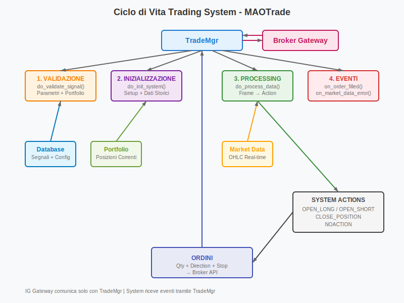

# MAOTrade - Sviluppo Trading Systems

## Struttura di un Trading System

Un trading system è una classe Python che eredita da BaseSystem e implementa la logica di trading. Il system riceve dati di mercato, calcola indicatori e restituisce azioni di trading.

```python
from maotrade.BaseSystem import BaseSystem
from maotrade.utils.Costants import SystemAction

class MACDSystem(BaseSystem):
    
    def _do_init(self):
        """Richiamata per inizializzare la classe del system al posto della __init__"""
        self._state['sma_fast'] = []
        self._state['sma_slow'] = []
        self._state['last_signal'] = 0
        self._state['position_open'] = False
```

## Salvataggio Stato del System

Per salvare i dati del system basta memorizzarli nel dizionario `self._state`. Ad ogni chiamata a funzioni del system viene salvato automaticamente a DB per essere disponibile in caso di crash del server.

```python
def _do_init(self):
    # Tutto quello che metti in self._state viene salvato automaticamente
    self._state['indicator_values'] = []
    self._state['last_signal_time'] = 0
    self._state['current_trend'] = 0
```

## Ciclo di Vita di un System


### 1. Validazione Segnale

Prima dell'avvio, il system valida i parametri e le condizioni di mercato:

```python
def do_validate_signal(self, signal: dict, system_params: dict, portfolio: dict,
                      import_uid: str = "") -> bool:
    """
    Esegue la validazione del segnale secondo le regole del system
    
    :param signal: Il segnale da validare
    :type signal: dict
    :param system_params: Tutti i parametri di configurazione del system
    :type system_params: dict
    :param portfolio: Il portafoglio corrente con tutte le posizioni
    :type portfolio: dict
    :param import_uid: L'id dell'importazione da usare per il log
    :type import_uid: str (optional)
    :return: True la validazione è OK, False validazione fallita
    """
    # Controlla parametri obbligatori
    if not self.check_system_param(system_params, 'fast_period',
                                  "Periodo SMA veloce mancante", "", import_uid):
        return False
        
    if not self.check_system_param(system_params, 'slow_period',
                                  "Periodo SMA lenta mancante", "", import_uid):
        return False
    
    # Valida parametri
    fast_period = self.get_system_param(system_params, 'fast_period')
    slow_period = self.get_system_param(system_params, 'slow_period')
    
    if fast_period >= slow_period:
        self.consoleLog("SMA veloce deve essere minore di SMA lenta",
                       Severity.ERROR, import_uid)
        return False
    
    return True
```

### 2. Inizializzazione System

Se la validazione passa, il system viene inizializzato:

```python
def do_initialize_system(self, portfolio: dict, import_uid: str, is_first_init: bool) -> bool:
    """
    Esegue l'inizializzazione del system.
    
    :param portfolio: Il portafoglio corrente con tutte le posizioni
    :type portfolio: dict
    :param import_uid: L'id dell'importazione da usare per il log
    :type import_uid: str
    :param is_first_init: True è la prima inizializzazione, False inizializzazione a seguito di modifica segnale
    :type is_first_init: bool
    :return: True l'inizializzazione è OK, False inizializzazione fallita
    """
    # Estrae parametri utente
    self._fast_period = self.get_system_param(self._system_params, 'fast_period')
    self._slow_period = self.get_system_param(self._system_params, 'slow_period')
    self._stop_percent = self.get_system_param(self._system_params, 'stop_percent')
    
    # Inizializza stato
    self._state['sma_fast'] = []
    self._state['sma_slow'] = []
    self._state['last_crossover'] = 0
    
    # Ottiene posizione corrente se presente
    position = portfolio.get(self.epic, {})
    self._state['position_open'] = position.get('qty', 0) != 0
    
    self.consoleLog(f"MACD System inizializzato: SMA {self._fast_period}/{self._slow_period}",
                   Severity.INFO, import_uid)
    return True
```

## Processing Dati Real-time

Il cuore del system è `do_process_data`, chiamata ad ogni frame di dati:

```python
def do_process_data(self, frame_data: dict, portfolio: dict) -> (SystemAction, float, float):
    """
    Consente di elaborare il segnale del system.
    
    Il parametro frame_data avrà il seguente tracciato:
    * int **frame** - Unix timestamp del time frame
    * float **open** - Prezzo di apertura
    * float **low** - Prezzo minimo
    * float **high** - Prezzo massimo
    * float **close** - Prezzo di chiusura
    * float **vol** - Volume
    * bool **timeFrameEnd** - True se la candela è chiusa, False se è in progress
    * bool **orderSubmitting** - True se un ordine è in esecuzione, False nessun ordine in esecuzione
    
    :param frame_data: Data frame da processare
    :type frame_data: dict
    :param portfolio: Il portafoglio corrente con tutte le posizioni
    :type portfolio: dict
    :return: Una tupla con (SystemAction, quantità, stop)
    """
    # Aggiorna le medie mobili
    self._update_sma(frame_data['close'])
    
    # Serve lo storico per calcolare crossover
    if len(self._state['sma_fast']) < self._slow_period:
        return SystemAction.NOACTION, 0, 0
    
    # Ottiene posizione corrente
    current_position = portfolio.get(self._params['epic'], {})
    current_qty = current_position.get('qty', 0)
    
    # Opera solo su candele complete
    if frame_data['timeFrameEnd']:
        # Calcola crossover
        sma_fast_now = self._state['sma_fast'][-1]
        sma_slow_now = self._state['sma_slow'][-1]
        sma_fast_prev = self._state['sma_fast'][-2]
        sma_slow_prev = self._state['sma_slow'][-2]
        
        # Golden Cross (veloce supera lenta dal basso)
        if (sma_fast_prev <= sma_slow_prev and sma_fast_now > sma_slow_now and
            current_qty == 0):
            quantity = 100  # Quantità fissa per semplicità
            stop_price = frame_data['close'] * (1 - self._stop_percent / 100)
            
            self.consoleLog(f"Golden Cross: SMA {self._fast_period}={sma_fast_now:.2f} > "
                           f"SMA {self._slow_period}={sma_slow_now:.2f}",
                           Severity.INFO)
            return SystemAction.ACTION_BUY, quantity, stop_price
        
        # Death Cross (veloce scende sotto lenta dall'alto)
        elif (sma_fast_prev >= sma_slow_prev and sma_fast_now < sma_slow_now
              and current_qty > 0):
            self.consoleLog(f"Death Cross: SMA {self._fast_period}={sma_fast_now:.2f} < "
                           f"SMA {self._slow_period}={sma_slow_now:.2f}", Severity.INFO)
            return SystemAction.ACTION_FLAT, 0, 0
    
    return SystemAction.NOACTION, 0, 0

def _update_sma(self, price: float):
    """Aggiorna le medie mobili con il nuovo prezzo"""
    # Aggiorna SMA veloce
    self._state['sma_fast'].append(price)
    if len(self._state['sma_fast']) > self._fast_period:
        self._state['sma_fast'].pop(0)
    
    # Aggiorna SMA lenta
    self._state['sma_slow'].append(price)
    if len(self._state['sma_slow']) > self._slow_period:
        self._state['sma_slow'].pop(0)
```

### SystemAction Types

| Costante | Valore | Descrizione |
|----------|--------|-------------|
| `SystemAction.NOACTION` | 0 | Nessuna azione |
| `SystemAction.ACTION_DELAY` | 1 | Ritarda azione |
| `SystemAction.ACTION_PREBUY` | 2 | Pre-acquisto |
| `SystemAction.ACTION_BUY` | 3 | Acquista |
| `SystemAction.ACTION_PRESELL` | 4 | Pre-vendita |
| `SystemAction.ACTION_SELL` | 5 | Vendi |
| `SystemAction.ACTION_BUYLOST` | 6 | Acquisto perso |
| `SystemAction.ACTION_SELLLOST` | 7 | Vendita persa |
| `SystemAction.ACTION_BUYSELL` | 8 | Acquisto e vendita |
| `SystemAction.ACTION_HOLD` | 9 | Mantieni posizione |
| `SystemAction.ACTION_FLAT` | 10 | Chiudi posizione |
| `SystemAction.ACTION_STPR` | 11 | Stop richiesto |

## Eventi di Sistema

Il system riceve eventi durante l'esecuzione:

### Eventi Ordini

```python
def on_order_accepted(self, order: dict):
    """Chiamata quando un ordine viene accettato dal broker"""
    self._state['last_order_time'] = order['timestamp']
    self.consoleLog(f"Ordine accettato: {order['qty']}", Severity.INFO)

def on_order_filled(self, order: dict, time_now: int):
    """Chiamata quando un ordine viene eseguito dal broker"""
    self._state['position_open'] = order['qty'] != 0
    self._state['last_fill_price'] = order['avgFillPrice']
    self.consoleLog(f"Eseguito: {order['qty']} @ {order['avgFillPrice']}", Severity.INFO)

def on_order_error(self, order: dict):
    """Chiamata quando c'è un errore nell'esecuzione ordine"""
    self.consoleLog(f"Errore ordine: {order['errorMessage']}", Severity.ERROR)
```

### Eventi Dati

```python
def on_market_data_error(self):
    """Chiamata quando i dati di mercato non sono disponibili"""
    self._state['data_error'] = True
    self.consoleLog("Dati mercato non disponibili", Severity.WARNING)

def on_market_data_restore(self):
    """Chiamata quando i dati di mercato vengono ripristinati"""
    self._state['data_error'] = False
    self.consoleLog("Dati mercato ripristinati", Severity.INFO)
```

## Gestione Stato e Resume

```python
def do_resume_system(self, frame_data: list[dict], portfolio: dict, chart: ChartData, state: dict, 
                    log: list, time_now: int, import_uid: str) -> bool:
    """
    Esegue la ripresa del system nel caso di interruzione improvvisa del server.
    
    Il parametro frame_data avrà il seguente tracciato:
    * int **timestamp** - Time frame espresso in Unix timestamp
    * float **open** - Il prezzo di apertura
    * float **low** - Il prezzo minimo
    * float **high** - Il prezzo massimo
    * float **close** - Il prezzo di chiusura
    * float **volume** - I volumi
    * float **count** - Numero di contratti
    * int **numBars** - Il numero di frames utilizzati per comporre questo frame
    * str **date** - Il time frame espresso come stringa
    
    :param frame_data: Lista dei frames di dati processati nella giornata operativa
    :type frame_data: list
    :param portfolio: Il portafoglio corrente con tutte le posizioni
    :type portfolio: dict
    :param chart: Il grafico del system salvato prima del blocco. Se non disponibile None
    :type chart: ChartData
    :param state: Lo stato del system come salvato prima del blocco
    :type state: dict
    :param log: Lista dei messaggi di log
    :type log: list
    :param time_now: Unix timestamp dell'ora corrente
    :type time_now: int
    :param import_uid: L'id dell'importazione da usare per il log
    :type import_uid: str
    :return: True la ripresa è avvenuta correttamente, False ripresa del system fallita
    """
    # Ripristina stato interno
    if state:
        self._state.update(state)
    
    # Ricalcola indicatori da dati storici
    for frame in frame_data:
        self._update_sma(frame['close'])
    
    self.consoleLog("MACD System ripristinato correttamente", Severity.INFO, import_uid)
    return True
```

## Utilities per System

### Accesso Parametri

```python
def get_system_param(system_params: dict, key: str):
    """
    Torna un valore di un parametro se trovato e se valorizzato
    
    :param system_params: Dizionario con i parametri del system
    :type system_params: dict
    :param key: Id del parametro di cui si vuole estrarre il valore
    :type key: str
    """
    return system_params[key]['value'] if system_params.get(key, None) is not None and (
        system_params[key].get('value', None) is not None) else None

# Uso
fast_period = self.get_system_param(system_params, 'fast_period')
```

### Validazione Parametri

```python
def check_system_param(self, system_params: dict, key: str, error_message_value_not_present: str,
                      error_message_value_error: str, import_uid: str) -> bool:
    """
    Controlla se il valore è presente se passato error_message_value_not_present e se il valore
    è corretto se passato error_message_value_error; se questi due campi sono passati
    vuoti, i rispettivi controlli non verranno eseguiti
    
    :param system_params: Dizionario con i parametri del system
    :type system_params: dict
    :param key: Id del parametro di cui si vuole estrarre il valore
    :type key: str
    :param error_message_value_not_present: Messaggio da mostrare se il valore non è presente
    :type error_message_value_not_present: str
    :param error_message_value_error: Messaggio da mostrare se il valore sia errato
    :type error_message_value_error: str
    :param import_uid: Id dell'importazione per i messaggi di log
    :type import_uid: str
    """
```

## Esempio Completo: Sistema MACD

```python
class MACDCrossover(BaseSystem):
    
    def _do_init(self):
        """Richiamata per inizializzare la classe del system al posto della __init__"""
        self._state['sma_fast'] = []
        self._state['sma_slow'] = []
        self._state['last_crossover'] = 0
        self._state['position_open'] = False
    
    def do_validate_signal(self, signal, system_params, portfolio, import_uid):
        required_params = ['fast_period', 'slow_period', 'stop_percent']
        
        for param in required_params:
            if not self.check_system_param(system_params, param,
                                          f"{param} mancante", "", import_uid):
                return False
        
        # Valida che veloce < lenta
        fast = self.get_system_param(system_params, 'fast_period')
        slow = self.get_system_param(system_params, 'slow_period')
        
        if fast >= slow:
            self.consoleLog("SMA veloce deve essere < SMA lenta",
                           Severity.ERROR, import_uid)
            return False
        
        return True
    
    def do_initialize_system(self, portfolio, import_uid, is_first_init):
        self._fast_period = self.get_system_param(self._system_params, 'fast_period')
        self._slow_period = self.get_system_param(self._system_params, 'slow_period')
        self._stop_percent = self.get_system_param(self._system_params, 'stop_percent')
        
        # Stato iniziale
        self._state['sma_fast'] = []
        self._state['sma_slow'] = []
        
        return True
    
    def do_process_data(self, frame_data, portfolio):
        if not frame_data['timeFrameEnd']:
            return SystemAction.NOACTION, 0, 0
        
        # Aggiorna SMA
        self._update_sma(frame_data['close'])
        
        # Serve storico sufficiente
        if len(self._state['sma_fast']) < self._slow_period:
            return SystemAction.NOACTION, 0, 0
        
        # Calcola crossover
        fast_now = self._state['sma_fast'][-1]
        slow_now = self._state['sma_slow'][-1]
        fast_prev = self._state['sma_fast'][-2]
        slow_prev = self._state['sma_slow'][-2]
        
        current_qty = portfolio.get(self._params['epic'], {}).get('qty', 0)
        
        # Golden cross
        if fast_prev <= slow_prev and fast_now > slow_now and current_qty == 0:
            stop_price = frame_data['close'] * (1 - self._stop_percent / 100)
            return SystemAction.ACTION_BUY, 100, stop_price
        
        # Death cross
        elif fast_prev >= slow_prev and fast_now < slow_now and current_qty > 0:
            return SystemAction.ACTION_FLAT, 0, 0
        
        return SystemAction.NOACTION, 0, 0
    
    def _update_sma(self, price):
        # SMA veloce
        self._state['sma_fast'].append(price)
        if len(self._state['sma_fast']) > self._fast_period:
            self._state['sma_fast'].pop(0)
        
        # SMA lenta
        self._state['sma_slow'].append(price)
        if len(self._state['sma_slow']) > self._slow_period:
            self._state['sma_slow'].pop(0)
```

Questo sistema implementa un crossover di due medie mobili semplici. Quando la media veloce supera quella lenta viene generato un segnale di acquisto (golden cross), quando la veloce scende sotto la lenta viene generato un segnale di chiusura (death cross).